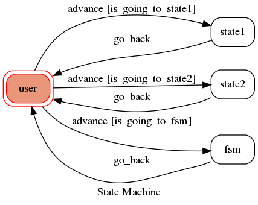

# TOC Project 2020

[](https://codeclimate.com/github/NCKU-CCS/TOC-Project-2020/maintainability)

[](https://snyk.io/test/github/NCKU-CCS/TOC-Project-2020)


Template Code for TOC Project 2020

A Line bot based on a finite state machine

More details in the [Slides](https://hackmd.io/@TTW/ToC-2019-Project#) and [FAQ](https://hackmd.io/s/B1Xw7E8kN)

## Setup

### Prerequisite
* Python 3.6
* Pipenv
* Facebook Page and App
* HTTPS Server

#### Install Dependency
```sh
pip3 install pipenv

pipenv --three

pipenv install

pipenv shell
```

* pygraphviz (For visualizing Finite State Machine)


#### Run the sever

```sh
python3 app.py
```

## Finite State Machine


## Usage
The initial state is set to `user`.

Every time `user` state is triggered to `advance` to another state, it will `go_back` to `user` state after the bot replies corresponding message.

* user
	* Input: "認識帥哥"
		* Reply: 隨機跑出一張教授的圖片

	* Input: "認識美眉"
		* Reply: 隨機跑出一張創作者的圖片
		
	* Input: "FSM"
	    * Reply: 跑出狀態圖

    * Other Input
        * Reply: 一個顯示所有功能的Template，且可連結到創作者的FB

## Reference
[Pipenv](https://medium.com/@chihsuan/pipenv-更簡單-更快速的-python-套件管理工具-135a47e504f4) ❤️ [@chihsuan](https://github.com/chihsuan)

[TOC-Project-2019](https://github.com/winonecheng/TOC-Project-2019) ❤️ [@winonecheng](https://github.com/winonecheng)

Flask Architecture ❤️ [@Sirius207](https://github.com/Sirius207)

[Line line-bot-sdk-python](https://github.com/line/line-bot-sdk-python/tree/master/examples/flask-echo)

